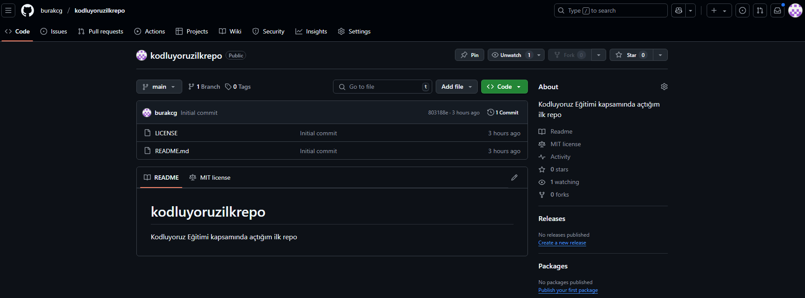

# Kodluyoruz Ilk Repo
[Kodluyoruz](https://kodluyoruz.org) Eğitimi kapsamında açtığım ilk repo

## Installation
Öncelikle projeyi clonelayın. (Buraya sizin reponuzdan aldığınız link gelecek)  
`git clone https://github.com/burakcg/kodluyoruzilkrepo.git`
## Usage
Projeyi cloneladıktan sonra Visual Studio Code programında açınız.

Linux için:

`cd kodluyoruzilkrepo code .`

## Contributing
Pull requestler kabul edilir. Büyük değişiklikler için, lütfen önce neyi değiştirmek istediğinizi tartışmak için bir konu açınız.

## License
[MIT](https://choosealicense.com/licenses/mit/)